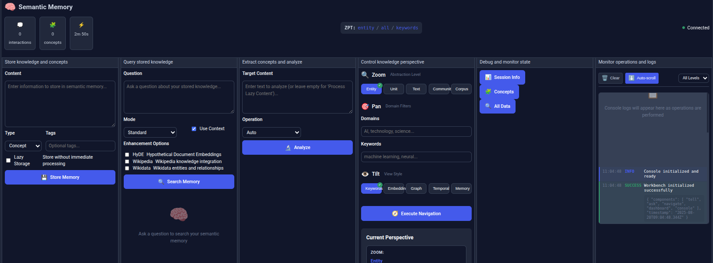

# Semem


## Semantic Web Memory for Intelligent Agents
 
*...or, Graph RAG on steroids for the global knowledgebase*
 
**tl;dr - flipping ideas (mostly) from the LLM world over to the Semantic Web for massively simplified integration, at global scale**

It has MCP facilities (stdio & HTTP) as well as a browser-based UI with chat.



**🐳 Quick Start with Docker**: A complete Docker Compose setup is available for easy deployment with all dependencies included. See [Docker Setup Guide](docs/manual/docker.md) for one-command installation.

**Interactive Chat Interface**: The workbench includes a natural language chat interface with slash commands (`/ask`, `/tell`, `/help`) and automatic URL/file ingestion. See [Chat Documentation](docs/manual/chat.md) for details.

**🧠 Persistent Memory System**: Every chat interaction is automatically stored in the SPARQL knowledge graph with semantic embeddings. The system retrieves relevant past conversations to inform future responses, creating a continuously learning memory that persists across sessions. Memory flows: Chat UI → ChatAPI → MemoryManager → SPARQL store with embeddings → retrieval for future context.

 The [hints](https://danja.github.io/semem/manual/hints.html) page might help.

**[Semem Documentation](https://danja.github.io/semem/)** - *sprawling*
 
Semem is an experimental Node.js toolkit for AI memory management that integrates large language models (LLMs) with Semantic Web technologies (RDF/SPARQL). It offers knowledge graph retrieval and augmentation algorithms within a conceptual model based on the [Ragno](https://github.com/danja/ragno) (knowledge graph description) and [ZPT](https://github.com/danja/zpt) (knowledge graph navigation) ontologies. [Tensegrity](https://github.com/danja/tensegrity) project.

The intuition is that while LLMs and associated techniques have massively advanced the field of AI and offer considerable utility, the typical approach is missing the elephant in the room: __the Web__ - the biggest known knowledgebase in our universe. Semantic Web technologies offer data integration at a global scale, with tried & tested conceptual models for knowledge representation. __There is a lot of low-hanging fruit.__


## Status 2025-09-29 : version 1.5.3

Core functionality is working well after significant refactoring. The tell/ask pipeline through both MCP and workbench UI is functioning correctly, with proper storage and retrieval through SPARQL. LLM provider priority system works with Groq as primary (fastest), fallback to Ollama for local processing. Enhanced logging throughout has improved debugging.

**Recent fixes:**
- Refactored the MCP layer, it's really the core of the system but most of it was implemented in a single **huge** file. Now a bit more logical (under `src/mcp`). To keep it real, used e2e integration tests working against live systems (under `tests/integration/mcp`).

**Still messy areas:**
- ZPT navigation concepts remain non-intuitive
- Codebase architecture needs consolidation
- Documentation sprawls and much is out-of-date
- Some test timing issues in automated environments

**Current activity**
- Working on a spike for visualization using self-organizing maps. The hope is it will help clarify the navigation ideas around ZPT.  
- Working on auxiliary stuff around Transmissions with a view to populating knowledgebase.
- Most tests need deleting and recreating...

*previously...*

MCP functionality focused down on 7 core verbs : *ask, tell, augment, zoom, pan, tilt, inspect*. See below and [this blog post](https://tensegrity.it/entries/2025-08-10_claude_simple_verbs.html) (in which Claude demonstrates an inability to count).

The UI has been totally re-written to reflect this, see [workbench-howto](https://github.com/danja/semem/blob/main/docs/manual/workbench-howto.md). Currently testing.

Most recent direct workflow experiment : [PDF ingestion](https://github.com/danja/semem/tree/main/examples/document#readme)

**SPARQL Document Ingestion**: Use `examples/ingestion/SPARQLIngest.js` for importing documents from SPARQL endpoints with configurable query templates (blog-articles, generic-documents, wikidata-entities). Supports batch processing, authentication, and direct integration with the semantic memory system.

See also :  [blog](https://tensegrity.it) (co-written with Claude Code)

## Architecture Diagrams

**Core Operation Flows**: Semem's primary operations follow well-defined information flow patterns:

- **📥 [Tell Operation Flow](docs/manual/tell.svg)** - Shows how content is ingested, processed through embedding generation and concept extraction, then stored in the dual SPARQL+FAISS system
- **📤 [Ask Operation Flow](docs/manual/ask.svg)** - Illustrates the multi-pass adaptive search process, context synthesis, and LLM-powered response generation

<details>
<summary>Mostly functional but very, very sketchy. It has an MCP server, HTTP API, a crude browser UI and code APIs. A lot to do before much will be remotely useful. It is in active development in June 2025. The codebase is big and chaotic, <strong>it is not for the fainthearted</strong>.</summary>

The codebase is registered as the npm package [semem](https://www.npmjs.com/package/semem) though there hasn't been much time spent on this angle, currently it's pretty much essential to use this repo. 

The dev process has involved pushing out in various directions with spikes, then circling back to ensure the core is still functional, then consolidation. To date it's been a one-man + various AI assistants (and a dog) operation. Despite me trying to keep things modular so they can be worked on in isolation, it's still complex enough that Claude (and I) struggle. <strong>Collaborators would be very welcome</strong>.
</details>
It is feature-complete as originally conceived, in the sense of <em><a href="https://www.youtube.com/watch?v=R7GeKLE0x3s">all the right notes, but not necessarily in the right order</a></em>. There is a lot of cruft and numerous bugs. Right now it's in a <strong>consolidation phase</strong>.

## System Overview

The SPARQL store, chat LLMs and embeddings service are all external. SPARQL uses the standard HTTP interfaces. There are also in-memory and JSON file storage subsystems but these are an artifact of dev history, though they can be useful as a fallback durin testing. LLMs use the [hyperdata-clients](https://github.com/danja/hyperdata-clients) library to simplify configuration. 

The system is layered in a couple of dimensions: interfacing may be direct (SDK-style) API, via the HTTP server or MCP server. Functionality is grouped by purpose broadly into *Basic*, *Ragno* and *ZPT*. 

There are fairly comprehensive demos under [examples](https://github.com/danja/semem/tree/main/examples) which exercise the different parts of the system (think manual integration tests).

### Basic 
This contains the low-level operations. It covers basic SPARQL store interactions, embeddings/*semantic search* and chat. There are also some minimal temporal/relevance-related parts that overlap with *Ragno*.

Internally the system relies on [RDF-Ext](https://github.com/rdf-ext) and other [RDFJS](http://rdf.js.org/) libraries for its graph model, [FAISS](https://github.com/facebookresearch/faiss) for its primary vector-oriented functionality.

### Ragno
This layer is concerned with the **knowledgebase model** as described by the [Ragno Ontology](https://github.com/danja/ragno). On top of the model are a set of algorithms that offer various knowledge retrieval and augmentation facilities. Most are lifted from the [NodeRAG paper](https://arxiv.org/abs/2504.11544), with additions such as [HyDE](https://arxiv.org/abs/2212.10496) *Hypothetical Document Embeddings* and Vectorised [Self-Organising Maps](https://en.wikipedia.org/wiki/Self-organizing_map).

### ZPT
This layer is concerned with **knowledgegraph navigation** built on the [ZPT Ontology](https://github.com/danja/zpt) following an analogy from the film world, *Zoom, Pan, Tilt*. Algorithms have been created to handle parameterisation of filters/selection and corpus decomposition and chunking.

## UI

Semem has a browser-based UI in progress. This won't be useful for actual knowledge work any time soon (if ever) but it will have a role in checking system behaviour and experimenting. 

---
The description below is very AI-sloppy. 


## 🚀 Quick Start - Simple Verbs Interface

Get started with Semem's natural language interface in 5 minutes:

### Prerequisites
- Node.js 20.11.0 or higher
- npm (comes with Node.js)

### Installation & Setup

1. **Clone and install:**
   ```bash
   git clone https://github.com/danja/semem.git
   cd semem
   npm install
   ```

2. **Start the MCP server:**
   ```bash
   npm run mcp:http
   # OR
   node mcp/http-server.js
   ```
   The server starts on `http://localhost:4105` with Simple Verbs REST endpoints.

### Try the 7 Simple Verbs

**Store knowledge with `tell`:**
```bash
curl -X POST http://localhost:4105/tell \
  -H "Content-Type: application/json" \
  -d '{"content": "Machine learning is a subset of AI that enables computers to learn", "type": "concept"}'
```

**Query knowledge with `ask`:**
```bash
curl -X POST http://localhost:4105/ask \
  -H "Content-Type: application/json" \
  -d '{"question": "What is machine learning?"}'
```

**Set context with `zoom` and `pan`:**
```bash
# Set abstraction level
curl -X POST http://localhost:4105/zoom \
  -d '{"level": "entity"}'

# Apply domain filtering  
curl -X POST http://localhost:4105/pan \
  -d '{"domains": ["AI", "technology"], "keywords": ["machine learning"]}'
```

**Check your ZPT state:**
```bash
curl http://localhost:4105/state
```

### Alternative Startup Options

**Workbench Development:**
```bash
npm run start:workbench  # Start workbench server (port 8081)
npm run dev              # Start webpack dev server with hot reload (port 9000)
```

**Legacy API servers:**
```bash
npm start  # Starts both API server (port 4100) and legacy UI server (port 4120)
```

**MCP Server for Claude Desktop:**
```bash
# Run MCP server for Claude Desktop integration (local dev)
npm run mcp

# Run MCP HTTP server (local dev)
npm run mcp:http

# Or via published package (most reliable method)
git clone https://github.com/danja/semem.git
cd semem
npm install
npm run mcp                      # Stdio MCP server
npm run mcp:http                 # HTTP MCP server on port 4105

# Alternative: Direct node execution
node mcp/index.js                # Stdio MCP server  
node mcp/http-server.js          # HTTP MCP server on port 4105
```

**Development mode:**
```bash
npm run dev              # Webpack dev server for workbench UI
npm run start:mcp        # MCP server backend
```

### 🤖 Claude Desktop Integration

Add Semem to your Claude Desktop MCP configuration:

```json
{
  "mcpServers": {
    "semem": {
      "command": "node",
      "args": ["/path/to/semem/mcp/index.js"]
    }
  }
}
```

**Alternative setup (after cloning repository):**
```json
{
  "mcpServers": {
    "semem": {
      "command": "npm",
      "args": ["run", "mcp"],
      "cwd": "/path/to/semem"
    }
  }
}
```

Then use the 7 Simple Verbs directly in Claude Desktop conversations!

## 🖥️ Workbench UI Features

### Semantic Memory Workbench
The modern web-based interface implementing the 7 Simple Verbs:

**Core Panels:**
- **Tell**: Store content with lazy/immediate processing options
- **Ask**: Query knowledge with HyDE, Wikipedia, Wikidata, and Web Search enhancements  
- **Augment**: Extract concepts and process lazy content
- **Navigate**: ZPT (Zoom/Pan/Tilt) knowledge space navigation with real-time feedback
- **Inspect**: Debug system state and session cache
- **Console**: Real-time log viewing with filtering and search

**Key Features:**
- **Real-time ZPT State Display**: Current zoom/pan/tilt settings with descriptions
- **Visual Navigation Feedback**: Execute navigation with loading states and results
- **Session Statistics**: Track interactions, concepts, and session duration
- **Connection Status**: Live backend connectivity monitoring

**Development Access:**
```bash
npm run start:workbench  # Direct workbench server (port 8081)
npm run dev              # Webpack dev server with hot reload (port 9000)
```

### Legacy UI Components
The original UI system includes VSOM visualization and SPARQL browser (via `npm start`).

## 🚀 Key Features

- **🗣️ Simple Verbs Interface**: 7-verb natural language API (tell, ask, augment, zoom, pan, tilt, inspect) for intuitive semantic operations
- **🧠 Semantic Memory**: Intelligent context retrieval and memory organization with vector embeddings and SPARQL
- **🕸️ Knowledge Graph Processing**: End-to-end Ragno pipeline for entity extraction and relationship modeling
- **🎯 Zoom, Pan Tilt (ZPT)**: Knowledge navigation and processing with persistent state management
- **🔌 Model Context Protocol (MCP)**: JSON-RPC 2.0 API for seamless LLM and agent integration with workflow orchestration
- **🚀 MCP Prompts**: 8 pre-built workflow templates for complex multi-step operations
- **🔍 Advanced Algorithms**: HyDE, Web Search integration, VSOM, graph analytics, community detection, and Personal PageRank
- **📊 Interactive Visualizations**: VSOM (Vector Self-Organizing Maps) for high-dimensional data exploration
- **🔗 Multi-Provider LLM Support**: Groq (default), Ollama, Claude, Mistral, and other providers via unified connector system
- **📊 Multiple Storage Backends**: In-memory, JSON, and SPARQL/RDF with caching optimization

## 🗣️ Simple Verbs Interface

Semem features a **7-verb natural language interface** that simplifies complex knowledge operations into conversational commands:

### The 7 Simple Verbs

| Verb | Purpose | Example |
|------|---------|---------|
| **tell** | Store information with automatic embeddings | `tell: "Machine learning uses neural networks"` |
| **ask** | Query stored knowledge with semantic search | `ask: "What is machine learning?"` |
| **augment** | Extract concepts and enhance content | `augment: {"target": "text to analyze", "operation": "concepts"}` |
| **zoom** | Set abstraction level (entity/unit/text/community/corpus) | `zoom: {"level": "entity"}` |
| **pan** | Apply domain/temporal/keyword filtering | `pan: {"domains": ["AI"], "keywords": ["neural networks"]}` |
| **tilt** | Choose view perspective (keywords/embedding/graph/temporal) | `tilt: {"style": "embedding"}` |
| **inspect** | Debug and examine stored memories and session cache | `inspect: {"what": "session", "details": true}` |

### Quick Example Workflow

```bash
# Store knowledge
curl -X POST http://localhost:4105/tell \
  -d '{"content": "The 7 Simple Verbs simplify semantic operations"}'

# Set context  
curl -X POST http://localhost:4105/zoom -d '{"level": "entity"}'
curl -X POST http://localhost:4105/pan -d '{"domains": ["MCP"], "keywords": ["verbs"]}'

# Query with context
curl -X POST http://localhost:4105/ask \
  -d '{"question": "What are the Simple Verbs?"}'
```

The system maintains **persistent ZPT state** across operations, enabling contextual conversations with your knowledge base. All verbs work via REST API, MCP protocol, or direct SDK calls.

See [docs/PROMPT.md](docs/PROMPT.md) for detailed usage instructions.

## 📊 Data Visualization

Semem includes an advanced VSOM (Vector Self-Organizing Map) visualization system for exploring high-dimensional data:

### Key Features
- Interactive SOM grid visualization with zoom/pan
- Real-time training visualization
- Feature map exploration (U-Matrix, component planes)
- Interactive clustering of SOM nodes
- Responsive design for all screen sizes

### Getting Started

1. Navigate to the VSOM tab in the Semem UI
2. Load or train a SOM model
3. Explore the visualization and interact with nodes
4. Use the feature maps to understand data relationships

For more details, see the [VSOM Documentation](docs/features/vsom/README.md).

## 📁 Project Structure

```
semem/
├── src/                           # Core library code
│   ├── handlers/                 # LLM and embedding handlers
│   ├── stores/                   # Storage backends (JSON, SPARQL, etc.)
│   ├── connectors/               # LLM provider connectors
│   ├── servers/                  # HTTP server implementations
│   ├── ragno/                    # Knowledge graph algorithms
│   ├── zpt/                      # Zero-Point Traversal system
│   └── frontend/
│       ├── workbench/            # Modern workbench UI (primary)
│       │   ├── public/           # Workbench source files
│       │   └── server.js         # Workbench development server
│       └── [legacy]/             # Legacy UI components
├── dist/                         # Build outputs
│   └── workbench/               # Built workbench application
├── examples/                     # Organized examples by category
│   ├── basic/                   # Core functionality examples
│   ├── ragno/                   # Knowledge graph examples
│   ├── mcp/                     # MCP integration examples
│   ├── zpt/                     # ZPT processing examples
│   └── pending/                 # Work-in-progress examples
├── mcp/                          # MCP server implementation
│   ├── http-server.js           # Primary MCP HTTP server
│   ├── tools/                   # MCP tool implementations
│   └── prompts/                 # MCP workflow templates
├── config/                       # Configuration files
├── webpack.config.js             # Workbench build configuration
└── docs/                        # Comprehensive documentation
```

## 🌐 Server Architecture

Semem provides a complete HTTP server infrastructure with a modern workbench-first approach:

### Primary Components

#### 🧠 **MCP Server** (`mcp/http-server.js`)
The primary server providing both MCP protocol and Simple Verbs REST API:

- **Simple Verbs REST API**: 7-verb natural language interface (tell, ask, augment, zoom, pan, tilt, inspect)
- **MCP Protocol**: JSON-RPC 2.0 API for LLM integration (32 tools + 15 resources + 8 prompts)
- **Session Management**: Persistent ZPT state across operations
- **Error Handling**: Robust error recovery and partial results

**Key Simple Verbs Endpoints:**
```
POST /tell               # Store content with embeddings
POST /ask                # Query knowledge with semantic search
POST /augment            # Extract concepts and enhance content
POST /zoom               # Set abstraction level
POST /pan                # Apply domain/temporal filtering  
POST /tilt               # Choose view perspective
POST /inspect            # Debug system state
GET  /state              # Get current ZPT state
```

#### 🖥️ **Workbench** (`src/frontend/workbench/`)
Modern web-based interface implementing the 7 Simple Verbs:

- **Interactive Panels**: Tell, Ask, Augment, Navigate, Inspect, Console
- **Real-time Feedback**: ZPT state display and navigation results
- **Development Server**: Hot reload with webpack dev server
- **Session Tracking**: Live statistics and connection monitoring

#### 🔥 **Legacy API Server** (`api-server.js`)
REST API server for backward compatibility:

- **Memory Operations**: Store, search, and retrieve semantic memories
- **Chat Interface**: Conversational AI with context awareness
- **Embedding Services**: Vector embedding generation and management
- **Configuration Management**: Dynamic provider and storage configuration

#### 🚀 **Server Manager** (`server-manager.js`)
Process management system for coordinating multiple server instances:

- **Process Lifecycle**: Start, monitor, and gracefully stop servers
- **Port Management**: Automatic port conflict resolution
- **Health Monitoring**: Real-time process status tracking
- **Signal Handling**: Graceful shutdown coordination
- **Logging**: Centralized output management with timestamps

#### 🎯 **Start All** (`start-all.js`)
Orchestration script for launching the complete server ecosystem:

- **Configuration Loading**: Unified config system integration
- **Multi-Server Startup**: Coordinated API and UI server launch
- **Interactive Control**: Keyboard shortcuts for shutdown (Ctrl+C, 'q')
- **Error Handling**: Robust startup failure recovery

### Quick Server Deployment

**Recommended - Workbench Development:**
```bash
# Start MCP server (backend)
npm run start:mcp                 # MCP server (port 4105)

# Start workbench (frontend) 
npm run start:workbench           # Workbench server (port 8081)
# OR for development with hot reload
npm run dev                       # Webpack dev server (port 9000)
```

**Legacy - Full Server Stack:**
```bash
# Start all legacy servers
./start.sh                        # API server (4100) + UI server (4120)
# OR
npm start

# Individual server startup
node src/servers/api-server.js    # API only (port 4100)
node mcp/http-server.js           # MCP server (port 4105)
```

### Server Configuration

Servers are configured via `config/config.json`:

```json
{
  "servers": {
    "api": 4100,      # API server port
    "ui": 4120,       # UI server port
    "redirect": 4110, # Optional redirect port
    "redirectTarget": 4120
  },
  "storage": {
    "type": "sparql",  # or "json", "memory"
    "options": { /* storage-specific config */ }
  },
  "llmProviders": [
    { /* provider configurations */ }
  ]
}
```

## 🐳 Docker Deployment

Semem provides comprehensive Docker support for both development and production deployments with a multi-service architecture.

> 📖 **[Complete Docker Guide](docs/manual/docker.md)** - Detailed installation, configuration, and troubleshooting instructions

### Quick Start with Docker

**1. Production Deployment:**
```bash
# Clone the repository
git clone https://github.com/danja/semem.git
cd semem

# Copy your existing .env or create from template
cp .env.docker.example .env
# Edit .env with your API keys (same format as local)

# Start all services
docker compose up -d

# Check service status
docker compose ps
docker compose logs -f semem
```

**2. Development Deployment:**
```bash
# Use your existing .env file (works as-is)
docker compose -f docker-compose.dev.yml up -d

# View logs
docker compose -f docker-compose.dev.yml logs -f semem-dev
```

> ℹ️ **Need Help?** See the [Docker Guide](docs/manual/docker.md) for detailed installation steps, troubleshooting, and advanced configuration options.

### Services Architecture

The Docker deployment includes the following services:

| Service | Description | Ports | Purpose |
|---------|-------------|-------|---------|
| **semem** | Main application container | 4100, 4101, 4102 | API, MCP, Workbench servers |
| **fuseki** | Apache Jena SPARQL database | 3030 | RDF/SPARQL storage backend |
| **nginx** | Reverse proxy (optional) | 80, 443 | SSL termination, load balancing |

### Environment Configuration

#### Production Environment (.env.docker)

```bash
# Core Configuration
NODE_ENV=production
SEMEM_API_KEY=your-secure-api-key

# SPARQL Store Configuration
SPARQL_HOST=localhost         # SPARQL server hostname (localhost for local, fuseki for Docker)
SPARQL_PORT=3030             # SPARQL server port (3030 for local, 4050 for Docker external access)
SPARQL_USER=admin
SPARQL_PASSWORD=your-secure-password

# LLM Provider API Keys (configure at least one)
MISTRAL_API_KEY=your-mistral-key
CLAUDE_API_KEY=your-claude-key
OPENAI_API_KEY=your-openai-key
NOMIC_API_KEY=your-nomic-key

```

#### Development Environment (.env.docker.dev)

The development environment uses simplified configuration with optional external API keys.

### Volume Management

**Persistent Data:**
- `fuseki_data`: SPARQL database storage
- `semem_data`: Application data and cache
- `semem_logs`: Application logs

**Configuration Management:**
```bash
# Production: mount configuration
./config/config.docker.json:/app/config/config.json:ro

# Development: live code editing
./src:/app/src:ro
```

### Advanced Deployment Options

#### 1. Production with SSL (using nginx profile)

```bash
# Generate SSL certificates
mkdir -p nginx/ssl
openssl req -x509 -nodes -days 365 -newkey rsa:2048 \
  -keyout nginx/ssl/semem.key -out nginx/ssl/semem.crt

# Start with reverse proxy
docker compose --profile proxy up -d
```


#### 2. Multi-architecture builds

```bash
# Build for multiple architectures
docker buildx build --platform linux/amd64,linux/arm64 -t semem:latest .
```

### Health Monitoring

**Service Health Checks:**
```bash
# Check all services
docker compose ps

# Individual service health
curl http://localhost:4100/health    # API server
curl http://localhost:4102/health    # Workbench
curl http://localhost:3030/$/ping    # Fuseki
```

**Application Logs:**
```bash
# Follow all logs
docker compose logs -f

# Specific service logs
docker compose logs -f semem
docker compose logs -f fuseki
```

### Troubleshooting

#### Common Issues

**1. Port conflicts:**
```bash
# Check port usage
sudo lsof -i :4100,4101,4102,3030,11434

# Modify ports in docker-compose.yml if needed
```

**2. Permission issues:**
```bash
# Fix volume permissions
sudo chown -R 1001:1001 ./data ./logs
```


**3. SPARQL connection issues:**
```bash
# Check Fuseki status
curl -f http://localhost:3030/$/ping

# Restart Fuseki
docker compose restart fuseki
```

#### Performance Tuning

**Resource Limits:**
```yaml
# In docker-compose.yml
deploy:
  resources:
    limits:
      memory: 4G
      cpus: '2.0'
```

**JVM Settings for Fuseki:**
```bash
# Environment variable in docker-compose.yml
JVM_ARGS=-Xmx2g -Xms1g
```

### Development Workflow

**Live Development with Docker:**
```bash
# Start development stack
docker compose -f docker-compose.dev.yml up -d

# Make changes to source code (auto-reloaded via volumes)
# Rebuild only when dependencies change
docker compose -f docker-compose.dev.yml build semem-dev

# Debug with logs
docker compose -f docker-compose.dev.yml logs -f semem-dev
```

**Development Tools:**
```bash
# Access development container
docker compose -f docker-compose.dev.yml exec semem-dev bash

# Run tests inside container
docker compose -f docker-compose.dev.yml exec semem-dev npm test

# Debug Node.js (port 9229 exposed)
# Connect your IDE debugger to localhost:9229
```

### Security Considerations

**Production Security:**
- Use strong passwords for SPARQL_PASSWORD
- Generate secure SEMEM_API_KEY  
- Keep API keys in secure environment files
- Use nginx with proper SSL configuration
- Regularly update base images

**Network Security:**
```bash
# Production: restrict external access
# Only expose necessary ports (80, 443 via nginx)
# Keep internal services (fuseki) on internal network
```

### Backup and Migration

**Data Backup:**
```bash
# Backup Fuseki data
docker run --rm -v semem_fuseki_data:/data -v $(pwd):/backup alpine tar czf /backup/fuseki-backup.tar.gz /data

# Backup application data
docker run --rm -v semem_semem_data:/data -v $(pwd):/backup alpine tar czf /backup/semem-data-backup.tar.gz /data
```

**Migration:**
```bash
# Export configuration
docker compose exec semem cat /app/config/config.json > config-backup.json

# Migrate to new deployment
# 1. Copy volumes or restore from backup
# 2. Update docker-compose.yml with new configuration
# 3. Start services
```

### Development and Production

**Development Mode:**
```bash
# Workbench development with hot reload
npm run dev                       # Webpack dev server (port 9000)
npm run start:mcp                 # MCP backend (port 4105)

# Legacy development
LOG_LEVEL=debug ./start.sh        # Legacy servers with debug logging
```

**Production Deployment:**
```bash
# Build workbench for production
npm run build:workbench

# Start production servers
NODE_ENV=production npm run start:mcp

# With process management (PM2)
pm2 start mcp/http-server.js --name semem-mcp
pm2 start src/frontend/workbench/server.js --name semem-workbench
```

### Server Monitoring

The server infrastructure includes comprehensive monitoring:

- **Health Checks**: `/api/health` endpoint with component status
- **Metrics**: `/api/metrics` endpoint with performance data  
- **Process Monitoring**: Real-time process status in server manager
- **Graceful Shutdown**: Proper cleanup on SIGTERM/SIGINT signals

## ⚡ Quick Start

### Installation

```bash
# Clone and install
git clone https://github.com/your-org/semem.git
cd semem
npm install

# Configure environment
cp example.env .env
# Edit .env with your API keys and settings
```

### Prerequisites

1. **Groq API Key** (recommended for fast cloud inference):
   ```bash
   # Set your API key in .env
   GROQ_API_KEY=your-groq-api-key
   ```

2. **Ollama** (optional for local processing):
   ```bash
   # Install required models
   ollama pull qwen2:1.5b         # For chat/text generation
   ollama pull nomic-embed-text   # For embeddings
   ```

3. **SPARQL Endpoint** (core semantic storage):
   ```bash
   # Using Docker
   docker run -d --name fuseki -p 3030:3030 stain/jena-fuseki
   ```

### Running Servers

```bash
# Start HTTP API and UI servers
./start.sh

# Access web interface
open http://localhost:4120

# Test API endpoints
curl http://localhost:4100/api/health
```

> 📖 See [Server Architecture](#-server-architecture) section for detailed server documentation.

### Running Examples

```bash
# Basic memory operations
node examples/basic/MemoryEmbeddingJSON.js

# Knowledge graph processing  
node examples/ragno/RagnoPipelineDemo.js

# MCP server integration (32 tools + 15 resources + 8 prompt workflows)
npm run mcp               # Start MCP server
node examples/mcp/SememCoreDemo.js           # Core memory operations
node examples/mcp/RagnoCorpusDecomposition.js # Knowledge graphs
node examples/mcp/ZPTBasicNavigation.js      # 3D navigation

# Complete ZPT suite (5 comprehensive demos)
node examples/mcp/ZPTBasicNavigation.js      # Navigation fundamentals
node examples/mcp/ZPTAdvancedFiltering.js    # Multi-dimensional filtering
node examples/mcp/ZPTUtilityTools.js         # Schema and validation
node examples/mcp/ZPTPerformanceOptimization.js # Performance tuning
node examples/mcp/ZPTIntegrationWorkflows.js # Cross-system integration

# MCP Prompts workflows (NEW!)
# Start MCP server first: npm run mcp
# Then use Claude Desktop or other MCP clients to execute:
# - semem-research-analysis: Analyze research documents
# - semem-memory-qa: Q&A with semantic memory
# - ragno-corpus-to-graph: Build knowledge graphs from text
# - semem-full-pipeline: Complete memory+graph+navigation workflows
```

## 🧠 Core Components

### Semantic Memory
- **Vector embeddings** for semantic similarity
- **Context window management** with intelligent chunking
- **Multi-backend storage** (JSON, SPARQL, in-memory)
- **Intelligent retrieval** with relevance scoring

### Knowledge Graph (Ragno)
- **Corpus decomposition** into semantic units and entities
- **Relationship extraction** and RDF modeling
- **Community detection** using Leiden algorithm
- **Graph analytics** (centrality, k-core, PageRank)

### Zero-Point Traversal (ZPT)
- **Zoom/Pan/Tilt navigation** paradigm
- **Content chunking** strategies (semantic, fixed, adaptive)
- **Corpuscle selection** algorithms
- **Transformation pipelines** for content processing

### Model Context Protocol (MCP)
- **32 comprehensive tools** covering all Semem capabilities
- **15 specialized resources** for documentation and data access
- **8 MCP Prompts** for workflow orchestration and multi-step operations
- **Complete ZPT integration** with 6 navigation tools
- **Cross-system workflows** combining Memory + Ragno + ZPT
- **Standardized API** for LLM integration with schema validation

### MCP Prompts - Workflow Orchestration
Transform complex multi-step operations into simple, guided workflows:

**Memory Workflows:**
- `semem-research-analysis` - Research document analysis with semantic memory context
- `semem-memory-qa` - Q&A using semantic memory retrieval and context assembly
- `semem-concept-exploration` - Deep concept exploration through memory relationships

**Knowledge Graph Construction:**
- `ragno-corpus-to-graph` - Transform text corpus to structured RDF knowledge graph
- `ragno-entity-analysis` - Analyze and enrich entities with contextual relationships

**3D Navigation:**
- `zpt-navigate-explore` - Interactive 3D knowledge space navigation and analysis

**Integrated Workflows:**
- `semem-full-pipeline` - Complete memory → graph → navigation processing pipeline
- `research-workflow` - Academic research document processing and insight generation

**Key Features:**
- **Multi-step Coordination**: Chain multiple tools with context passing
- **Dynamic Arguments**: Type validation, defaults, and requirement checking
- **Conditional Execution**: Skip workflow steps based on conditions
- **Error Recovery**: Graceful handling of failures with partial results
- **Execution Tracking**: Unique execution IDs and detailed step results

## 🤖 Advanced Algorithms

### HyDE (Hypothetical Document Embeddings)
Enhances retrieval by generating hypothetical answers using LLMs, with uncertainty modeling via `ragno:maybe` properties.

```bash
node examples/ragno/Hyde.js
```

### Web Search Integration
Provides real-time information access through DuckDuckGo web search, enabling queries about current events, recent developments, and time-sensitive information not available in static knowledge sources.

```bash
# Web search is integrated into the enhancement system
# Available through Ask interface with useWebSearch option
curl -X POST http://localhost:4105/ask \
  -H "Content-Type: application/json" \
  -d '{"question": "Latest AI developments", "useWebSearch": true}'
```

### VSOM (Vectorized Self-Organizing Maps)
Provides entity clustering and semantic organization with support for multiple topologies.

```bash
node examples/ragno/VSOM.js
```

### Graph Analytics Suite
- **K-core decomposition** for dense cluster identification
- **Betweenness centrality** for bridge node discovery
- **Community detection** (Leiden algorithm)
- **Personalized PageRank** for semantic traversal

```bash
node examples/ragno/AnalyseGraph.js
node examples/ragno/Communities.js
node examples/ragno/PPR.js
```

## 📚 Examples Documentation

The `examples/` directory contains comprehensive demonstrations organized by functionality:

- **🧠 Basic Examples** (`examples/basic/`): Core memory operations, embedding generation, search
- **🕸️ Ragno Examples** (`examples/ragno/`): Knowledge graph processing, entity extraction, RDF
- **🔌 MCP Examples** (`examples/mcp/`): **Complete MCP integration with 32 tools + 15 resources + 8 prompt workflows**
  - **ZPT Suite**: 5 comprehensive demos covering all ZPT navigation capabilities ✅ COMPLETE
  - **Memory Integration**: Core semantic memory with context management
  - **Knowledge Graphs**: Ragno corpus decomposition and RDF processing
  - **Cross-System Workflows**: Advanced integration patterns
  - **🚀 MCP Prompts**: 8 workflow templates for orchestrating complex multi-step operations ✅ NEW!
- **🎯 ZPT Examples** (`examples/zpt/`): Content processing and navigation

See [examples/README.md](examples/README.md) and [examples/mcp/README.md](examples/mcp/README.md) for detailed documentation and usage instructions.

## 🔧 Configuration

### Storage Backends

**JSON Storage** (simple persistence):
```json
{
  "storage": {
    "type": "json",
    "options": {
      "filePath": "./data/memories.json"
    }
  }
}
```

**SPARQL Storage** (semantic web integration):
```json
{
  "storage": {
    "type": "sparql",
    "options": {
      "query": "http://${SPARQL_HOST:-localhost}:${SPARQL_PORT:-3030}/semem/sparql",
      "update": "http://${SPARQL_HOST:-localhost}:${SPARQL_PORT:-3030}/semem/update",
      "data": "http://${SPARQL_HOST:-localhost}:${SPARQL_PORT:-3030}/semem/data",
      "graphName": "http://hyperdata.it/content",
      "user": "${SPARQL_USER}",
      "password": "${SPARQL_PASSWORD}"
    }
  }
}
```

### Environment Variable Substitution

Semem supports environment variable substitution in configuration files using `${VARIABLE_NAME:-default}` syntax:

**SPARQL Connection Variables:**
- `SPARQL_HOST`: SPARQL server hostname (defaults to `localhost`)
- `SPARQL_PORT`: SPARQL server port (defaults to `3030`)
- `SPARQL_USER`: SPARQL database username
- `SPARQL_PASSWORD`: SPARQL database password

**Usage Examples:**
```bash
# Local development (uses defaults: localhost:3030)
npm start

# Custom SPARQL endpoint
export SPARQL_HOST=fuseki.example.com
export SPARQL_PORT=8080
npm start

# Docker automatically sets: SPARQL_HOST=fuseki, SPARQL_PORT=4050
docker compose up -d
```

#### Session-Level Memory Cache

Semem implements a **hybrid storage strategy** that combines persistent storage with session-level caching for immediate semantic retrieval:

**How it works:**
- **`tell` operations** store content in both persistent storage (SPARQL/JSON) AND a session-level cache
- **`ask` operations** search session cache first, then persistent storage, combining results by semantic similarity
- **Immediate availability**: Recently stored concepts are immediately available for retrieval within the same session
- **Semantic similarity**: Uses cosine similarity on embeddings for intelligent result ranking

**Session cache features:**
- **In-memory vector search** with similarity caching for performance
- **Concept tracking** - maintains a set of all concepts from the session
- **Debugging support** - use `inspect` tool to examine cache contents:
  ```bash
  curl -X POST http://localhost:4105/inspect \
    -H "Content-Type: application/json" \
    -d '{"what": "session", "details": true}'
  ```

This solves the common issue where `tell` → `ask` operations couldn't find recently stored content due to indexing delays in persistent storage.

### LLM Providers

Configure multiple providers in `config/config.json`:

```json
{
  "llmProviders": [
    {
      "type": "groq",
      "apiKey": "${GROQ_API_KEY}",
      "chatModel": "llama-3.1-8b-instant",
      "priority": 1,
      "capabilities": ["chat"]
    },
    {
      "type": "mistral",
      "apiKey": "${MISTRAL_API_KEY}",
      "chatModel": "mistral-small-latest",
      "priority": 2,
      "capabilities": ["chat"]
    },
    {
      "type": "ollama",
      "baseUrl": "http://localhost:11434",
      "chatModel": "qwen2:1.5b",
      "embeddingModel": "nomic-embed-text",
      "priority": 2,
      "capabilities": ["chat", "embedding"]
    }
  ]
}
```

## 🔌 MCP Integration

Semem implements Anthropic's [Model Context Protocol (MCP)](https://docs.anthropic.com/en/docs/agents-and-tools/mcp) for seamless LLM integration:

### Using from NPM Package

If you've installed Semem as an npm package, you can run the MCP server directly:

```bash
# Install globally
npm install -g semem

# Run MCP server via npx (recommended)
npx semem mcp

# Run HTTP MCP server
npx semem mcp-http --port=3000

# Or if installed globally
semem mcp
semem mcp --transport http --port 3000
```

### Using from Source

```bash
# Start MCP server
npm run mcp

# Connect from Claude Desktop or other MCP clients
# Server provides 32 tools + 15 resources + 8 prompt workflows covering all Semem capabilities
```

### Claude Desktop Configuration

Add to your Claude Desktop MCP configuration:

```json
{
  "mcpServers": {
    "semem": {
      "command": "npx",
      "args": ["semem mcp"]
    }
  }
}
```

Or for HTTP transport:

```json
{
  "mcpServers": {
    "semem": {
      "command": "npx", 
      "args": ["semem mcp-http", "--port=3000"],
      "env": {
        "MCP_PORT": "3000"
      }
    }
  }
}

### Available MCP Tools (32 Total)
- **Memory Operations** (5 tools): Store, retrieve, generate responses, embeddings, concepts
- **Storage Management** (6 tools): Backend switching, backup/restore, migration, statistics
- **Context Management** (4 tools): Context windows, configuration, pruning, summarization
- **System Monitoring** (4 tools): Configuration, metrics, health checks, system status
- **Knowledge Graphs** (8 tools): Ragno corpus decomposition, entity extraction, SPARQL, analytics
- **ZPT Navigation** (6 tools): 3D navigation, filtering, validation, schema, optimization

### Available MCP Prompts (8 Workflows)
- **Memory Workflows** (3): Research analysis, memory Q&A, concept exploration
- **Knowledge Graph** (2): Corpus-to-graph, entity analysis  
- **3D Navigation** (1): Interactive exploration
- **Integrated** (2): Full pipeline, research workflow

### Available MCP Resources (15 Total)
- **System Resources** (7): Status, API docs, schemas, configuration, metrics
- **Ragno Resources** (4): Ontology, pipeline guide, examples, SPARQL templates
- **ZPT Resources** (4): Navigation schema, examples, concepts guide, performance optimization

## 🧪 Testing

```bash
# Run core tests
npm test

# Run LLM-dependent tests
npm run test:llms

# Generate coverage report
npm run test:coverage

# Run with specific test file
npm test -- tests/unit/Config.spec.js
```

## 🛠️ Development

### Project Scripts

```bash
# Development - Workbench
npm run dev                # Webpack dev server with hot reload (port 9000)
npm run start:workbench    # Workbench server (port 8081)
npm run start:mcp          # MCP server (port 4105)

# Build
npm run build              # Full build (types + workbench)
npm run build:workbench    # Build workbench for production
npm run build:dev          # Development build

# Testing
npm test                   # Run unit and integration tests
npm run test:unit          # Run unit tests only
npm run test:coverage      # Generate coverage report
npm run test:e2e           # End-to-end tests

# Documentation
npm run docs               # Generate JSDoc documentation

# Legacy Servers
./start.sh                 # Start all legacy servers (API + UI)
node src/servers/api-server.js     # API server only (port 4100)

# MCP Server
npm run mcp                # Start MCP server (stdio mode)
npm run mcp:http           # Start MCP HTTP server (port 4105)
```

### Workbench Development Workflow

**Quick Start:**
```bash
# Terminal 1: Start MCP backend
npm run start:mcp

# Terminal 2: Start development server  
npm run dev
# Opens http://localhost:9000 with hot reload
```

**Architecture:**
- **Frontend**: Webpack dev server (port 9000) with hot module replacement
- **Backend**: MCP server (port 4105) with Simple Verbs REST API  
- **Proxy**: Webpack automatically proxies API calls to MCP server
- **Build Output**: `dist/workbench/` contains production build

**Key Features:**
- **Hot Reload**: Changes to workbench files trigger automatic browser refresh
- **Source Maps**: Full debugging support in development mode
- **Module Aliases**: Clean imports with `@workbench`, `@services`, `@components`
- **Live Backend**: MCP server provides real semantic memory functionality

**Production Build:**
```bash
npm run build:workbench  # Creates optimized bundle in dist/workbench/
```

### Adding New Examples

1. Place in appropriate category directory (`basic/`, `ragno/`, `mcp/`, `zpt/`)
2. Follow naming convention: `PascalCase.js`
3. Include comprehensive documentation
4. Add error handling and cleanup
5. Update examples/README.md

## 📖 Documentation

- **[Examples Documentation](examples/README.md)**: Comprehensive examples guide
- **[API Documentation](docs/api/README.md)**: REST API and SDK reference
- **[MCP Documentation](docs/mcp/README.md)**: Model Context Protocol integration
- **[MCP Prompts Guide](mcp/prompts/resources/prompt-guide.md)**: Complete workflow orchestration guide
- **[MCP Prompts Examples](mcp/prompts/resources/examples.md)**: Real-world usage patterns
- **[Architecture Guide](docs/architecture.md)**: System design and components
- **[Algorithm Documentation](docs/ragno/README.md)**: Advanced algorithms guide

## 🔍 Troubleshooting

### Common Issues

**Ollama Connection:**
```bash
# Check Ollama status
ollama list
curl http://localhost:11434/api/tags
```

**SPARQL Endpoint:**
```bash
# Test connectivity
curl -X POST http://localhost:3030/dataset/query \
  -H "Content-Type: application/sparql-query" \
  -d "SELECT * WHERE { ?s ?p ?o } LIMIT 1"
```

**Memory Issues:**
```bash
# Increase Node.js memory limit
export NODE_OPTIONS="--max-old-space-size=4096"
```

### Debug Mode

Enable detailed logging:
```bash
LOG_LEVEL=debug node examples/basic/MemoryEmbeddingJSON.js
```

## 🤝 Contributing

1. Fork the repository
2. Create a feature branch
3. Add tests for new functionality  
4. Update documentation
5. Submit a pull request

### Code Style
- Use ES modules
- Follow existing patterns
- Include JSDoc comments
- Add comprehensive error handling

## 📄 License

MIT License - see [LICENSE](LICENSE) for details.

## 🔗 Links

- **Documentation**: [docs/](docs/)
- **Examples**: [examples/](examples/)
- **MCP Server**: [mcp/](mcp/)
- **Issue Tracker**: [GitHub Issues](https://github.com/your-org/semem/issues)

---

**Semem** - Intelligent semantic memory for the AI age.