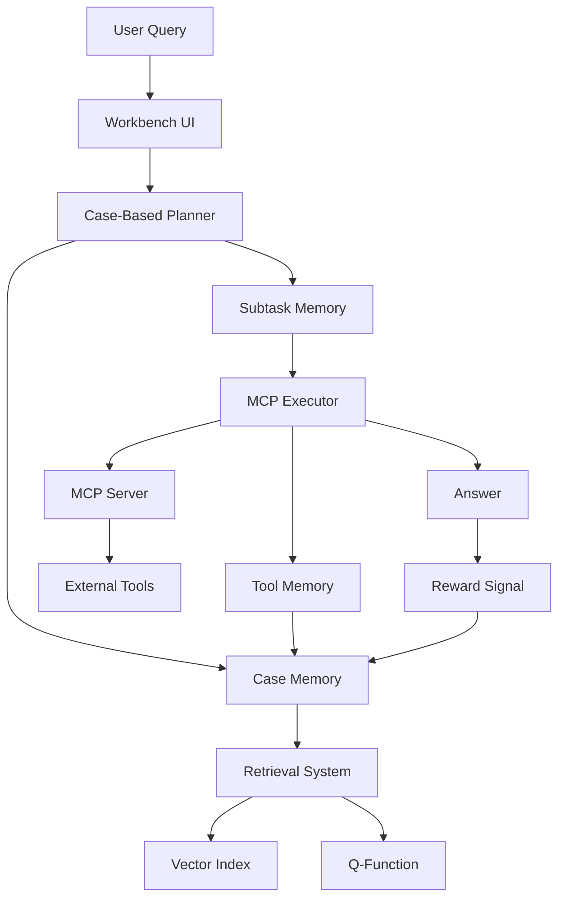

# Memento-Semem Integration Architecture

## Overview

This architecture integrates Memento's memory-augmented learning paradigm into Semem's semantic memory system, creating an adaptive agent framework that learns from experience without fine-tuning LLMs. The integration leverages Semem's existing SPARQL/RDF infrastructure, embedding capabilities, and MCP server to implement case-based reasoning (CBR) with continuous online learning.

## Core Design Principles

1. **Leverage Existing Infrastructure**: Build upon Semem's SPARQL store, embedding system, and MCP server
2. **Phased Implementation**: Incremental rollout with evaluation gates between phases
3. **Backward Compatibility**: Maintain existing Semem functionality while adding new capabilities
4. **Semantic Integration**: Use RDF ontologies to model case memory and trajectories
5. **Hybrid Retrieval**: Combine Semem's vector search with Memento's Q-learning adaptation

## System Architecture

### 1. Memory Layer (Foundation)

#### Case Memory Store
- **Implementation**: Extend SPARQL store with new RDF ontology for cases
- **Namespace**: `memento:` (http://purl.org/memento/)
- **Core Classes**:
  - `memento:Case` - Episodic memory unit
  - `memento:Trajectory` - Complete task execution path
  - `memento:State` - Task/question representation
  - `memento:Action` - Plan or decision taken
  - `memento:Reward` - Success/failure signal

#### Memory Types
```
┌─────────────────────────────────────┐
│         SPARQL Triple Store         │
├─────────────────────────────────────┤
│  Case Memory    │  Subtask Memory   │
│  (Episodic)     │  (Working)        │
├─────────────────────────────────────┤
│  Tool Memory    │  Context Memory   │
│  (Procedural)   │  (Semantic)       │
└─────────────────────────────────────┘
```

### 2. Retrieval Layer (Adaptive CBR)

#### Non-Parametric Retrieval (Phase 1)
- **Base**: Semem's existing FAISS vector index
- **Enhancement**: SimCSE encoding for case states
- **Similarity**: Cosine similarity with context weighting
- **Integration**: `src/memento/retrieval/NonParametricCBR.js`

#### Parametric Retrieval (Phase 2)
- **Q-Function**: Neural network for case value estimation
- **Architecture**: 2-layer MLP with state embeddings
- **Learning**: Online updates via memory rewriting
- **Integration**: `src/memento/retrieval/ParametricCBR.js`

### 3. Agent Layer (Planner-Executor)

#### Case-Based Planner
```javascript
class CaseBasedPlanner {
  constructor(caseMemory, llmHandler) {
    this.caseMemory = caseMemory;
    this.llmHandler = llmHandler;
    this.retrievalPolicy = new RetrievalPolicy();
  }
  
  async plan(task) {
    // Retrieve relevant cases
    const cases = await this.caseMemory.retrieve(task, k=4);
    
    // Generate plan using cases as context
    const plan = await this.llmHandler.generatePlan(task, cases);
    
    // Decompose into subtasks
    return this.decomposePlan(plan);
  }
}
```

#### MCP-Based Executor
- **Leverage**: Existing MCP server at `mcp/http-server.js`
- **Tools**: Web search, code execution, document processing
- **Protocol**: Standard MCP for tool invocation
- **Memory**: Tool interaction logging per subtask

### 4. Learning Layer (Online Adaptation)

#### Write Operation
```turtle
memento:case_123 a memento:Case ;
    memento:hasState "What is quantum computing?" ;
    memento:hasStateEmbedding "BASE64_VECTOR" ;
    memento:hasAction """
        1. Define quantum computing basics
        2. Explain qubits and superposition
        3. Describe quantum gates
    """ ;
    memento:hasReward 0.85 ;
    memento:timestamp "2025-01-13T10:30:00Z" ;
    prov:wasDerivedFrom ragno:corpuscle_456 .
```

#### Read Operation
- **Similarity Search**: Vector similarity on state embeddings
- **Contextual Filtering**: Domain and temporal relevance
- **Q-Value Ranking**: Learned importance weights
- **Result Fusion**: Combine multiple retrieval signals

### 5. Integration Points

#### With Ragno Knowledge Graph
- Cases linked to ragno:Entity and ragno:Relationship
- Attributes enriched with case outcomes
- Community detection for case clustering

#### With ZPT Navigation
- Case retrieval guided by ZPT zoom/pan/tilt
- Navigation history influences case selection
- Adaptive navigation based on case success

#### With Flow Components
- CaseMemory as new workflow component
- Integration with existing pipeline stages
- Case-based enhancement of answers

## Component Interactions



## Ontology Extensions

### Memento Ontology
```turtle
@prefix memento: <http://purl.org/memento/> .
@prefix ragno: <http://purl.org/ragno/> .

memento:Case rdfs:subClassOf ragno:Corpuscle ;
    rdfs:label "Case-based memory unit" .

memento:hasTrajectory a owl:ObjectProperty ;
    rdfs:domain memento:Case ;
    rdfs:range memento:Trajectory .

memento:Trajectory a owl:Class ;
    rdfs:label "Task execution trajectory" .

memento:hasQValue a owl:DatatypeProperty ;
    rdfs:domain memento:Case ;
    rdfs:range xsd:float .
```

## Data Flow

1. **Query Processing**
   - User query → Embedding generation
   - Embedding → Case retrieval
   - Cases → Context augmentation

2. **Planning Phase**
   - Augmented context → LLM planner
   - Plan → Subtask decomposition
   - Subtasks → Subtask memory

3. **Execution Phase**
   - Subtask → MCP executor
   - Executor → Tool invocation
   - Results → Tool memory

4. **Learning Phase**
   - Completion → Reward calculation
   - Trajectory → Case memory write
   - Q-function → Online update

## Performance Optimizations

### Caching Strategy
- Case embeddings cached in Redis
- Frequently accessed cases in memory
- Q-values updated incrementally

### Batch Processing
- Group similar queries for efficiency
- Parallel case retrieval
- Asynchronous tool execution

### Memory Management
- Case bank size limits (configurable)
- Pruning strategies for old cases
- Compression of trajectory data

## Monitoring & Evaluation

### Metrics
- Case retrieval relevance (MRR, NDCG)
- Planning success rate
- Execution accuracy
- Learning curve progression
- Memory efficiency

### Logging
- Detailed trajectory logging
- Case selection reasoning
- Tool invocation traces
- Performance benchmarks

## Security & Privacy

### Case Isolation
- Domain-based case separation
- User-specific memory banks
- Access control via SPARQL

### Data Protection
- Encryption of sensitive cases
- Anonymization of personal data
- Audit trails for case access