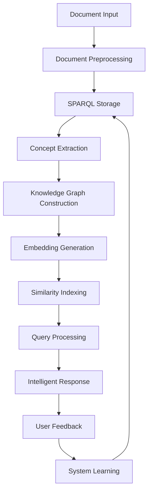

# Semem MCP Workflow System Enhancement Plan

## Executive Summary

This document outlines the design and implementation plan for enhancing Semem's workflow system to support intelligent document processing with SPARQL store integration, embeddings-based similarity search, and incremental improvement through user interactions.

## Current State Analysis

### Available MCP Tools (32 tools mapped)

#### Memory Management
- `mcp__semem__semem_store_interaction` - Store conversations with embeddings
- `mcp__semem__semem_retrieve_memories` - Search similar memories  
- `mcp__semem__semem_generate_response` - Context-aware response generation
- `mcp__semem__semem_generate_embedding` - Vector embedding generation
- `mcp__semem__semem_extract_concepts` - Concept extraction from text

#### Knowledge Graph (Ragno)
- `mcp__semem__ragno_decompose_corpus` - Convert text to RDF entities
- `mcp__semem__ragno_search_dual` - Dual search with vector similarity
- `mcp__semem__ragno_get_entities` - Retrieve entities with filtering
- `mcp__semem__ragno_vector_search` - HNSW vector similarity search
- `mcp__semem__ragno_export_rdf` - Export knowledge graph
- `mcp__semem__ragno_query_sparql` - Execute SPARQL queries
- `mcp__semem__ragno_analyze_graph` - Graph analytics and metrics

#### Storage Management  
- `mcp__semem__semem_switch_storage_backend` - Switch between storage types
- `mcp__semem__semem_backup_memory` - Backup to JSON/RDF formats
- `mcp__semem__semem_load_memory` - Load from backup files
- `mcp__semem__semem_storage_stats` - Storage statistics and health

#### System Operations
- `mcp__semem__semem_get_config` - Current system configuration
- `mcp__semem__semem_update_config` - Update configuration settings
- `mcp__semem__semem_get_metrics` - System metrics and performance
- `mcp__semem__semem_health_check` - Comprehensive health check

### Current Workflow Issues

1. **Tool Name Mismatch**: Workflows expect simplified names (`semem_extract_concepts`) but MCP tools use prefixed names (`mcp__semem__semem_extract_concepts`)

2. **Missing Tool Implementations**:
   - `research_ingest_documents` - Document preprocessing and ingestion
   - `research_generate_insights` - Comprehensive analysis and insight generation
   - `ragno_build_relationships` - Explicit relationship construction

3. **Workflow Orchestration Gaps**:
   - No data flow management between tools
   - Limited error handling and recovery
   - No incremental learning from user feedback

## Enhanced Workflow Architecture

### Core Design Principles

1. **SPARQL-First Storage**: All data stored in RDF format with embeddings for hybrid search
2. **Incremental Intelligence**: System learns and improves from user interactions
3. **Modular Composition**: Workflows composed of atomic, chainable operations
4. **Error Resilience**: Graceful degradation and recovery mechanisms
5. **Performance Optimization**: Caching, indexing, and parallel processing

### Primary Workflow: `enhanced-research-workflow`



### Secondary Workflows

#### 1. `intelligent-qa-workflow`
- **Purpose**: Answer questions using combined semantic search and knowledge graph reasoning
- **Stages**: Query analysis → Hybrid search → Context assembly → Response generation → Feedback integration

#### 2. `incremental-learning-workflow` 
- **Purpose**: Continuously improve system performance based on user interactions
- **Stages**: Interaction capture → Pattern analysis → Model adjustment → Performance validation

#### 3. `document-analysis-workflow`
- **Purpose**: Deep analysis of research documents with relationship mapping
- **Stages**: Document ingestion → Multi-level analysis → Relationship extraction → Summary generation

## Implementation Plan

### Phase 1: Core Infrastructure (2-3 weeks)

#### 1.1 Tool Name Mapping Layer
```javascript
// Create mapping between workflow names and MCP tool names
const TOOL_MAPPING = {
  'semem_extract_concepts': 'mcp__semem__semem_extract_concepts',
  'ragno_decompose_corpus': 'mcp__semem__ragno_decompose_corpus',
  'ragno_build_relationships': 'mcp__semem__ragno_analyze_graph',
  'research_generate_insights': 'mcp__semem__semem_generate_response'
};
```

#### 1.2 Missing Tool Implementation

**`research_ingest_documents`**:
```javascript
async function research_ingest_documents(documents, domain) {
  const results = [];
  for (const doc of documents) {
    // 1. Store in semantic memory
    const memoryResult = await mcp__semem__semem_store_interaction({
      prompt: `Document analysis: ${domain}`,
      response: doc.content,
      metadata: { ...doc.metadata, domain, timestamp: Date.now() }
    });
    
    // 2. Build knowledge graph
    const graphResult = await mcp__semem__ragno_decompose_corpus({
      textChunks: [{ content: doc.content, source: doc.source || 'unknown' }],
      options: { extractRelationships: true, generateSummaries: true }
    });
    
    results.push({ memoryId: memoryResult.id, entities: graphResult.entities });
  }
  return results;
}
```

**`research_generate_insights`**:
```javascript
async function research_generate_insights(concepts, entities, relationships, goals) {
  // 1. Retrieve related memories
  const memories = await mcp__semem__semem_retrieve_memories({
    query: concepts.join(' '),
    threshold: 0.7,
    limit: 10
  });
  
  // 2. Analyze graph relationships
  const graphAnalysis = await mcp__semem__ragno_analyze_graph({
    analysisTypes: ['statistics', 'centrality', 'communities'],
    options: { includeDetails: true }
  });
  
  // 3. Generate comprehensive insights
  const contextPrompt = `
    Concepts: ${concepts.join(', ')}
    Entities: ${entities.map(e => e.name).join(', ')}
    Analysis Goals: ${goals.join(', ')}
    Related Context: ${memories.memories.map(m => m.response).join('\n')}
    Graph Metrics: ${JSON.stringify(graphAnalysis.statistics)}
  `;
  
  const insights = await mcp__semem__semem_generate_response({
    prompt: `Generate comprehensive research insights based on: ${contextPrompt}`,
    useMemory: true,
    maxTokens: 2000
  });
  
  return {
    insights: insights.response,
    supportingEvidence: memories.memories,
    graphMetrics: graphAnalysis,
    recommendations: extractRecommendations(insights.response)
  };
}
```

#### 1.3 Workflow Orchestration Engine
```javascript
class WorkflowOrchestrator {
  async executeWorkflow(workflowName, args) {
    const workflow = await this.loadWorkflow(workflowName);
    const context = { input: args, results: [], errors: [] };
    
    for (const step of workflow.steps) {
      try {
        const mappedTool = TOOL_MAPPING[step.tool] || step.tool;
        const result = await this.executeTool(mappedTool, step.arguments, context);
        context.results.push({ step: step.name, result });
        
        // Update context with results for next step
        context = this.updateContext(context, result);
      } catch (error) {
        context.errors.push({ step: step.name, error: error.message });
        if (step.required) throw error; // Fail fast for required steps
      }
    }
    
    return context;
  }
  
  updateContext(context, result) {
    // Implement data flow between steps
    return { ...context, lastResult: result };
  }
}
```

### Phase 2: SPARQL Integration (2-3 weeks)

#### 2.1 Enhanced Storage Configuration
```javascript
// Default to CachedSPARQL for optimal performance
const storageConfig = {
  backend: 'CachedSPARQL',
  config: {
    endpoint: 'http://localhost:3030/semem/query',
    updateEndpoint: 'http://localhost:3030/semem/update', 
    graphName: 'http://semem.org/knowledge',
    cacheSize: 10000,
    cacheTTL: 3600000, // 1 hour
    enableEmbeddings: true,
    embeddingDimensions: 1536
  }
};

await mcp__semem__semem_switch_storage_backend(storageConfig);
```

#### 2.2 Hybrid Search Implementation
```javascript
async function hybridSearch(query, options = {}) {
  // 1. Vector similarity search
  const vectorResults = await mcp__semem__ragno_vector_search({
    query,
    options: { k: options.limit || 10, threshold: options.threshold || 0.7 }
  });
  
  // 2. SPARQL semantic search
  const sparqlQuery = `
    PREFIX ragno: <http://purl.org/stuff/ragno/>
    SELECT ?entity ?content ?score WHERE {
      ?entity ragno:hasContent ?content .
      ?entity ragno:relevanceScore ?score .
      FILTER(CONTAINS(LCASE(?content), LCASE("${query}")))
    }
    ORDER BY DESC(?score)
    LIMIT ${options.limit || 10}
  `;
  
  const sparqlResults = await mcp__semem__ragno_query_sparql({
    query: sparqlQuery,
    options: { format: 'json' }
  });
  
  // 3. Dual search combining both approaches
  const dualResults = await mcp__semem__ragno_search_dual({
    query,
    options: {
      combinedLimit: options.limit || 20,
      vectorSimilarityThreshold: options.threshold || 0.7,
      exactMatchThreshold: 0.8
    }
  });
  
  return {
    vectorResults,
    sparqlResults,
    combinedResults: dualResults,
    totalResults: dualResults.length
  };
}
```

### Phase 3: Intelligent Learning System (3-4 weeks)

#### 3.1 User Feedback Integration
```javascript
async function captureUserFeedback(queryId, response, feedback) {
  // Store feedback as training data
  await mcp__semem__semem_store_interaction({
    prompt: `Feedback for query: ${queryId}`,
    response: JSON.stringify({
      originalResponse: response,
      userFeedback: feedback,
      timestamp: Date.now(),
      feedbackType: feedback.type // 'positive', 'negative', 'correction'
    }),
    metadata: {
      category: 'user_feedback',
      queryId,
      feedbackScore: feedback.score
    }
  });
  
  // Trigger incremental learning
  if (feedback.type === 'correction') {
    await incrementalLearning(queryId, feedback);
  }
}

async function incrementalLearning(queryId, feedback) {
  // 1. Analyze feedback patterns
  const feedbackMemories = await mcp__semem__semem_retrieve_memories({
    query: 'user feedback correction',
    threshold: 0.6,
    limit: 50
  });
  
  // 2. Update knowledge graph based on corrections
  if (feedback.corrections) {
    await updateKnowledgeGraph(feedback.corrections);
  }
  
  // 3. Adjust similarity thresholds based on feedback
  await adjustSearchParameters(feedbackMemories);
}
```

#### 3.2 Adaptive Query Processing
```javascript
async function adaptiveQueryProcessing(query, userContext) {
  // 1. Analyze query complexity and intent
  const queryAnalysis = await mcp__semem__semem_extract_concepts({
    text: query
  });
  
  // 2. Retrieve user's interaction history
  const userHistory = await mcp__semem__semem_retrieve_memories({
    query: `user:${userContext.userId}`,
    threshold: 0.5,
    limit: 20
  });
  
  // 3. Adjust search strategy based on history
  const searchStrategy = determineSearchStrategy(queryAnalysis, userHistory);
  
  // 4. Execute adaptive search
  const results = await hybridSearch(query, {
    threshold: searchStrategy.threshold,
    limit: searchStrategy.limit,
    preferenceWeight: searchStrategy.userPreference
  });
  
  return results;
}
```

### Phase 4: Advanced Workflows (2-3 weeks)

#### 4.1 Enhanced Research Workflow
```json
{
  "name": "enhanced-research-workflow",
  "description": "Intelligent document processing with SPARQL storage and learning",
  "version": "2.0",
  "arguments": [
    {
      "name": "research_documents",
      "description": "Array of research documents to process",
      "required": true,
      "type": "array"
    },
    {
      "name": "domain_focus", 
      "description": "Research domain focus area",
      "required": false,
      "type": "string",
      "default": "general"
    },
    {
      "name": "analysis_goals",
      "description": "Specific analysis objectives",
      "required": false,
      "type": "array",
      "default": ["concept_extraction", "relationship_mapping", "insight_generation"]
    },
    {
      "name": "user_context",
      "description": "User interaction context for personalization",
      "required": false,
      "type": "object",
      "default": {}
    }
  ],
  "workflow": [
    {
      "step": "initialize_storage",
      "tool": "mcp__semem__semem_switch_storage_backend",
      "arguments": {
        "backend": "CachedSPARQL",
        "config": "${sparql_config}"
      },
      "description": "Initialize SPARQL storage with caching"
    },
    {
      "step": "ingest_documents", 
      "tool": "research_ingest_documents",
      "arguments": {
        "documents": "${research_documents}",
        "domain": "${domain_focus}"
      },
      "description": "Ingest documents into memory and knowledge graph"
    },
    {
      "step": "extract_concepts",
      "tool": "mcp__semem__semem_extract_concepts", 
      "arguments": {
        "text": "${combined_document_text}"
      },
      "description": "Extract key concepts from all documents"
    },
    {
      "step": "build_knowledge_graph",
      "tool": "mcp__semem__ragno_decompose_corpus",
      "arguments": {
        "textChunks": "${document_chunks}",
        "options": {
          "extractRelationships": true,
          "generateSummaries": true,
          "minEntityConfidence": 0.7
        }
      },
      "description": "Build comprehensive knowledge graph"
    },
    {
      "step": "analyze_relationships",
      "tool": "mcp__semem__ragno_analyze_graph",
      "arguments": {
        "analysisTypes": ["statistics", "centrality", "communities"],
        "options": {"includeDetails": true}
      },
      "description": "Analyze entity relationships and graph structure"
    },
    {
      "step": "generate_insights",
      "tool": "research_generate_insights",
      "arguments": {
        "concepts": "${extracted_concepts}",
        "entities": "${graph_entities}",
        "relationships": "${graph_relationships}",
        "goals": "${analysis_goals}"
      },
      "description": "Generate comprehensive research insights"
    },
    {
      "step": "create_summary",
      "tool": "mcp__semem__semem_generate_response",
      "arguments": {
        "prompt": "Create executive summary of research findings",
        "useMemory": true,
        "contextLimit": 10
      },
      "description": "Generate executive summary"
    }
  ],
  "outputs": {
    "concepts": "${extracted_concepts}",
    "entities": "${graph_entities}", 
    "insights": "${research_insights}",
    "summary": "${executive_summary}",
    "metrics": "${graph_analysis}"
  }
}
```

#### 4.2 Intelligent Q&A Workflow
```json
{
  "name": "intelligent-qa-workflow", 
  "description": "Answer questions using hybrid search and incremental learning",
  "arguments": [
    {
      "name": "question",
      "description": "User question to answer",
      "required": true,
      "type": "string"
    },
    {
      "name": "user_context",
      "description": "User interaction context",
      "required": false,
      "type": "object",
      "default": {}
    }
  ],
  "workflow": [
    {
      "step": "analyze_question",
      "tool": "mcp__semem__semem_extract_concepts",
      "arguments": {"text": "${question}"},
      "description": "Extract concepts from user question"
    },
    {
      "step": "adaptive_search",
      "tool": "adaptive_query_processing", 
      "arguments": {
        "query": "${question}",
        "userContext": "${user_context}"
      },
      "description": "Perform adaptive hybrid search"
    },
    {
      "step": "generate_answer",
      "tool": "mcp__semem__semem_generate_response",
      "arguments": {
        "prompt": "${question}",
        "useMemory": true,
        "contextLimit": 8
      },
      "description": "Generate context-aware answer"
    },
    {
      "step": "store_interaction",
      "tool": "mcp__semem__semem_store_interaction",
      "arguments": {
        "prompt": "${question}",
        "response": "${generated_answer}",
        "metadata": {
          "userContext": "${user_context}",
          "searchResults": "${search_results}",
          "timestamp": "${timestamp}"
        }
      },
      "description": "Store Q&A interaction for learning"
    }
  ]
}
```

## Performance Considerations

### 1. Caching Strategy
- **Memory Cache**: Frequently accessed embeddings and entities
- **SPARQL Cache**: Query result caching with TTL
- **Graph Cache**: Computed relationship metrics

### 2. Indexing Optimization
- **HNSW Vector Index**: For similarity search
- **RDF Triple Index**: For SPARQL queries
- **Concept Index**: For rapid concept lookup

### 3. Parallel Processing
- **Async Tool Execution**: Non-blocking workflow steps
- **Batch Processing**: Document ingestion in batches
- **Streaming Results**: Progressive result delivery

## Success Metrics

### 1. System Performance
- **Response Time**: < 2 seconds for simple queries, < 10 seconds for complex workflows
- **Accuracy**: > 85% relevance score for top-3 results
- **Throughput**: > 100 documents/minute processing rate

### 2. User Experience  
- **Answer Quality**: Progressive improvement based on feedback
- **Personalization**: Adaptive responses based on user history
- **Learning Rate**: Measurable improvement over time

### 3. Technical Metrics
- **Storage Efficiency**: Optimized RDF storage with embeddings
- **Cache Hit Rate**: > 70% for frequent queries
- **Error Recovery**: < 5% workflow failure rate

## Implementation Timeline

### Week 1-2: Core Infrastructure
- Tool mapping layer implementation
- Missing tool development
- Basic workflow orchestration

### Week 3-4: SPARQL Integration
- Enhanced storage configuration
- Hybrid search implementation
- Performance optimization

### Week 5-7: Intelligent Learning
- User feedback integration
- Adaptive query processing
- Incremental learning algorithms

### Week 8-10: Advanced Workflows
- Enhanced research workflow
- Intelligent Q&A workflow
- Testing and optimization

### Week 11-12: Testing & Documentation
- Comprehensive testing
- Performance tuning
- Documentation completion

## Risk Mitigation

### 1. Technical Risks
- **SPARQL Performance**: Implement caching and query optimization
- **Memory Usage**: Monitor and implement garbage collection
- **Embedding Costs**: Use local models when possible

### 2. Integration Risks
- **Tool Compatibility**: Extensive testing with all MCP tools
- **Data Migration**: Gradual migration with backup strategies
- **Version Compatibility**: Semantic versioning and backward compatibility

### 3. User Experience Risks
- **Learning Curve**: Comprehensive documentation and examples
- **Performance Expectations**: Clear performance guidelines
- **Data Privacy**: Transparent data handling policies

## Conclusion

This enhanced workflow system will transform Semem into a truly intelligent research assistant that learns and improves from user interactions while maintaining high performance through optimized SPARQL storage and hybrid search capabilities. The modular design ensures extensibility while the comprehensive testing strategy ensures reliability.

The implementation plan provides a clear roadmap for delivering these capabilities incrementally, allowing users to benefit from improvements as they become available while maintaining system stability throughout the development process.