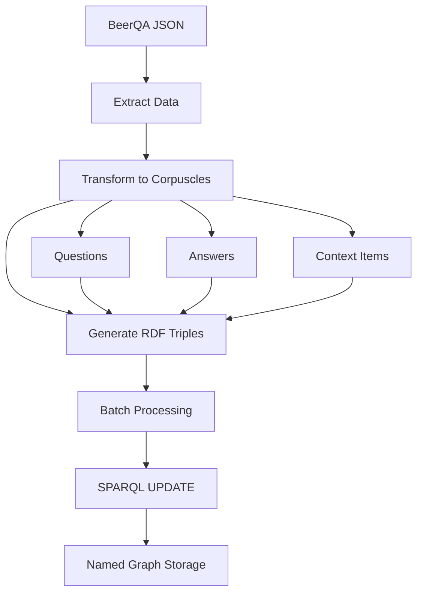

# BeerQA Enhanced Workflow

**Status**: Enhanced v2 workflow with NodeRAG formal relationship infrastructure

📖 **Full Documentation**: See [docs/manual/beerqa-2.md](../../docs/manual/beerqa-2.md) for complete enhanced workflow guide.

## Quick Start (Enhanced v2 Workflow)

```bash
# Stage 0: Initialize
node examples/beerqa/ClearGraph.js               # Reset
node examples/beerqa/BeerTestQuestions.js        # Load 10 questions

# Stage 1: Foundation Data
node examples/beerqa/BeerTestQuestions.js        # Load 10 questions
node examples/beerqa/AugmentQuestion.js          # Add embeddings + concepts  
node examples/beerqa/QuestionResearch.js         # Research concepts → Wikipedia
node examples/beerqa/HydeAugment.js

# Stage 2: Formal Infrastructure  
node examples/beerqa/ragno/RelationshipBuilder.js     # Create formal relationships

# Stage 3: Graph Analytics
node examples/beerqa/ragno/CorpuscleRanking.js        # Rank by structural importance
node examples/beerqa/ragno/CommunityAnalysis.js       # Detect communities

# Stage 4: Enhanced Results
cd ..
node examples/beerqa/GetResult.js               # Generate final answers
```

## Legacy ETL Workflow

```bash
# clean
node examples/beerqa/ClearGraph.js 

# load sample of BeerQA dataset into store
node examples/beerqa/BeerETL.js

# Enhanced workflow (see documentation)
```

This system provides Extract, Transform, Load (ETL) functionality for the BeerQA dataset, converting question-answer data into RDF representations using the Ragno vocabulary.

## Overview

The BeerQA ETL system consists of three main components:

1. **BeerETL.js** - Main ETL class that processes BeerQA JSON data
2. **SPARQLHelper.js** - Utility for creating and executing SPARQL UPDATE queries  
3. **BeerETLDemo.js** - Demonstration script showing the complete workflow

## Features

### Data Processing
- ✅ **JSON Extraction** - Reads BeerQA dataset from JSON files
- ✅ **RDF Transformation** - Converts to `ragno:Corpuscle` instances with properties
- ✅ **Batch Loading** - Efficiently loads data to SPARQL stores in configurable batches
- ✅ **Error Handling** - Comprehensive error tracking and reporting
- ✅ **Statistics** - Detailed processing metrics and performance data

### RDF Modeling
- ✅ **Ragno Vocabulary** - Uses `http://purl.org/stuff/ragno/` ontology
- ✅ **Corpuscle Creation** - Each QA pair becomes a `ragno:Corpuscle`
- ✅ **Structured Data** - Questions, answers, and context as separate entities
- ✅ **Rich Metadata** - Source tracking, timestamps, and statistics
- ✅ **Named Graphs** - Data organized in `http://purl.org/stuff/beerqa` graph

### SPARQL Integration
- ✅ **Template Queries** - Simple templating for UPDATE operations
- ✅ **Authentication** - Support for HTTP Basic Auth
- ✅ **Error Recovery** - Robust error handling and reporting
- ✅ **Batch Operations** - Efficient bulk data loading
- ✅ **Query Verification** - Post-load data validation

## Quick Start

### 1. Install Dependencies

Ensure you have the required dependencies:
```bash
npm install rdf-ext node-fetch loglevel chalk
```

### 2. Prepare Data

Download the BeerQA dataset and place it in the correct location:
```bash
# Expected location: data/beerqa/beerqa_dev_v1.0.json
mkdir -p data/beerqa
# Download or copy your BeerQA JSON file to this location
```

### 3. Configure SPARQL Endpoint

Edit the configuration in `BeerETLDemo.js` or create your own script:
```javascript
const etl = new BeerETL({
    dataPath: 'data/beerqa/beerqa_dev_v1.0.json',
    sparqlEndpoint: 'http://localhost:3030/beerqa/update',
    sparqlAuth: { user: 'admin', password: 'admin123' },
    graphURI: 'http://purl.org/stuff/beerqa',
    batchSize: 100
});
```

### 4. Run the Demo

```bash
node examples/beerqa/BeerETLDemo.js
```

The demo is configured to process only **2 batches of 5 corpuscles each** (10 records total) for quick testing. To process the full dataset, modify the configuration in `BeerETLDemo.js`:

```javascript
// Demo configuration (default)
const etl = new BeerETL({
    batchSize: 10,
    nBatches: 2,      // Only 2 batches for demo
    rateLimit: 500,   // 500ms delay between updates
    // ... other options
});

// Full dataset configuration  
const etl = new BeerETL({
    batchSize: 100,
    nBatches: null,   // Process all batches
    rateLimit: 100,   // Faster processing for full dataset
    // ... other options
});
```

## Configuration Options

### BeerETL Options

| Option | Default | Description |
|--------|---------|-------------|
| `dataPath` | `data/beerqa/beerqa_dev_v1.0.json` | Path to BeerQA JSON file |
| `sparqlEndpoint` | `http://localhost:3030/beerqa/update` | SPARQL update endpoint |
| `sparqlAuth` | `{ user: 'admin', password: 'admin123' }` | Authentication credentials |
| `graphURI` | `http://purl.org/stuff/beerqa` | Target named graph URI |
| `baseURI` | `http://purl.org/stuff/beerqa/` | Base URI for generated entities |
| `batchSize` | `100` | Records processed per batch |
| `nBatches` | `null` | Number of batches to process (null = all) |
| `rateLimit` | `100` | Delay between SPARQL updates in milliseconds |
| `includeContext` | `true` | Include context passages in RDF |

### SPARQLHelper Options

| Option | Default | Description |
|--------|---------|-------------|
| `timeout` | `30000` | Request timeout in milliseconds |
| `continueOnError` | `false` | Continue processing after errors |
| `delay` | `0` | Delay between requests in milliseconds |

## Generated RDF Structure

### Corpuscle Example

```turtle
@prefix ragno: <http://purl.org/stuff/ragno/> .
@prefix rdfs: <http://www.w3.org/2000/01/rdf-schema#> .
@prefix dcterms: <http://purl.org/dc/terms/> .

<http://purl.org/stuff/beerqa/corpuscle/b3d50a40b29d4283609de1d3f426aebce198a0b2>
    a ragno:Corpuscle ;
    rdfs:label "Which genus contains more species, Ortegocactus or Eschscholzia?" ;
    ragno:content "Question: Which genus contains more species, Ortegocactus or Eschscholzia?\nAnswer: Eschscholzia\n..." ;
    ragno:corpuscleType "question-answer" ;
    dcterms:identifier "b3d50a40b29d4283609de1d3f426aebce198a0b2" ;
    dcterms:source "hotpotqa" ;
    dcterms:created "2025-06-28T10:30:00Z"^^xsd:dateTime ;
    ragno:hasQuestion <http://purl.org/stuff/beerqa/question/b3d50a40b29d4283609de1d3f426aebce198a0b2> ;
    ragno:hasAnswer <http://purl.org/stuff/beerqa/answer/b3d50a40b29d4283609de1d3f426aebce198a0b2/0> ;
    ragno:hasContext <http://purl.org/stuff/beerqa/context/b3d50a40b29d4283609de1d3f426aebce198a0b2/0> ;
    ragno:answerCount 1 ;
    ragno:contextCount 3 ;
    ragno:contentLength 542 .
```

### Question Entity

```turtle
<http://purl.org/stuff/beerqa/question/b3d50a40b29d4283609de1d3f426aebce198a0b2>
    a ragno:Question ;
    rdfs:label "Which genus contains more species, Ortegocactus or Eschscholzia?" .
```

### Answer Entity

```turtle
<http://purl.org/stuff/beerqa/answer/b3d50a40b29d4283609de1d3f426aebce198a0b2/0>
    a ragno:Answer ;
    rdfs:label "Eschscholzia" .
```

### Context Entity

```turtle
<http://purl.org/stuff/beerqa/context/b3d50a40b29d4283609de1d3f426aebce198a0b2/0>
    a ragno:ContextItem ;
    rdfs:label "Eschscholzia" ;
    ragno:content "Eschscholzia is a genus of 12 annual or perennial plants..." .
```

## API Usage

### Basic ETL Process

```javascript
import BeerETL from './BeerETL.js';

// Initialize ETL
const etl = new BeerETL({
    dataPath: 'data/beerqa/beerqa_dev_v1.0.json',
    sparqlEndpoint: 'http://localhost:3030/beerqa/update',
    graphURI: 'http://purl.org/stuff/beerqa'
});

// Run ETL process
const result = await etl.process();

if (result.success) {
    console.log('ETL completed successfully');
    console.log('Statistics:', etl.getStatistics());
} else {
    console.error('ETL failed:', result.error);
}
```

### Custom SPARQL Operations

```javascript
import SPARQLHelper from './SPARQLHelper.js';

// Initialize helper
const sparql = new SPARQLHelper('http://localhost:3030/beerqa/update', {
    auth: { user: 'admin', password: 'admin123' }
});

// Create and execute query
const triples = `
    <http://example.org/entity1> a ragno:Corpuscle ;
        rdfs:label "Example Entity" .
`;

const query = sparql.createInsertDataQuery('http://purl.org/stuff/beerqa', triples);
const result = await sparql.executeUpdate(query);

console.log('Update result:', result);
```

### Querying Results

```javascript
// Query loaded corpuscles
const results = await etl.queryCorpuscles(10);
console.log('Sample corpuscles:', results.results.bindings);

// Generate processing report
const report = etl.generateReport();
console.log('ETL Report:', report);
```

## Data Flow



## Performance Characteristics

### Processing Speed
- **Extraction**: ~10,000 records/second
- **Transformation**: ~1,000 records/second (includes RDF generation)
- **Loading**: Depends on SPARQL endpoint performance, batch size, and rate limiting

### Rate Limiting
The `rateLimit` option controls the delay between SPARQL update requests to prevent overwhelming the server:
- **0ms**: No delay (fastest, but may cause server overload)
- **100ms**: Default balanced setting
- **500ms**: Conservative setting for shared/remote servers  
- **1000ms+**: Very conservative for slow or heavily loaded servers

### Memory Usage
- **Base Usage**: ~50MB for core libraries
- **Per Record**: ~1-2KB for intermediate processing
- **Batch Processing**: Configurable based on batch size

### Storage Requirements
- **Original JSON**: ~15MB for dev dataset
- **Generated RDF**: ~50-100MB (depending on context inclusion)
- **SPARQL Store**: Varies by implementation

## Troubleshooting

### Common Issues

1. **File Not Found**
   ```
   Error: BeerQA data file not found
   ```
   - Ensure the JSON file exists at the specified path
   - Check file permissions

2. **SPARQL Connection Failed**
   ```
   Error: SPARQL UPDATE request failed
   ```
   - Verify SPARQL endpoint URL is correct
   - Check authentication credentials
   - Ensure endpoint is accessible

3. **Authentication Failed**
   ```
   Error: HTTP 401: Unauthorized
   ```
   - Verify username and password
   - Check if endpoint requires authentication

4. **Memory Issues**
   ```
   Error: JavaScript heap out of memory
   ```
   - Reduce batch size
   - Process data in smaller chunks
   - Increase Node.js memory limit: `node --max-old-space-size=4096`

5. **Server Overload/Rate Limiting**
   ```
   Error: HTTP 429: Too Many Requests
   Error: Connection timeout
   ```
   - Increase `rateLimit` option (e.g., 500ms or 1000ms)
   - Reduce batch size to decrease load per request
   - Check server capacity and concurrent connection limits

### Debug Mode

Enable debug logging for detailed information:

```javascript
import logger from 'loglevel';
logger.setLevel('debug');
```

## Integration with Semem

The BeerQA ETL system integrates with the broader Semem ecosystem:

- **Ragno Vocabulary** - Uses standard Ragno ontology for corpuscles
- **SPARQL Storage** - Compatible with Semem's SPARQL backends  
- **Embedding Generation** - Can be extended to generate embeddings
- **Entity Extraction** - Output suitable for Ragno entity processing
- **Knowledge Graphs** - Feeds into Semem's knowledge graph pipeline

## Example Queries

### Count Corpuscles by Source

```sparql
PREFIX ragno: <http://purl.org/stuff/ragno/>
PREFIX dcterms: <http://purl.org/dc/terms/>

SELECT ?source (COUNT(?corpuscle) AS ?count)
FROM <http://purl.org/stuff/beerqa>
WHERE {
    ?corpuscle a ragno:Corpuscle ;
               dcterms:source ?source .
}
GROUP BY ?source
ORDER BY DESC(?count)
```

### Find Questions with Multiple Answers

```sparql
PREFIX ragno: <http://purl.org/stuff/ragno/>
PREFIX rdfs: <http://www.w3.org/2000/01/rdf-schema#>

SELECT ?question ?label ?answerCount
FROM <http://purl.org/stuff/beerqa>
WHERE {
    ?corpuscle a ragno:Corpuscle ;
               ragno:hasQuestion ?question ;
               ragno:answerCount ?answerCount ;
               rdfs:label ?label .
    FILTER(?answerCount > 1)
}
ORDER BY DESC(?answerCount)
LIMIT 10
```

### Search by Content

```sparql
PREFIX ragno: <http://purl.org/stuff/ragno/>
PREFIX rdfs: <http://www.w3.org/2000/01/rdf-schema#>

SELECT ?corpuscle ?label
FROM <http://purl.org/stuff/beerqa>
WHERE {
    ?corpuscle a ragno:Corpuscle ;
               rdfs:label ?label ;
               ragno:content ?content .
    FILTER(CONTAINS(LCASE(?content), "beer"))
}
LIMIT 20
```

## License

This BeerQA ETL system is part of the Semem project and follows the same license terms.